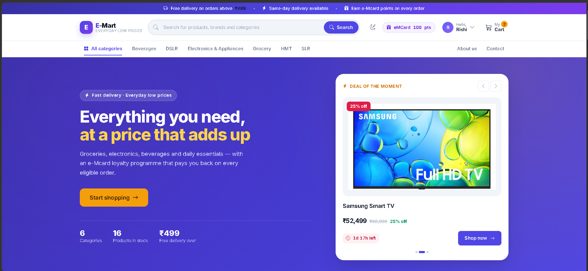
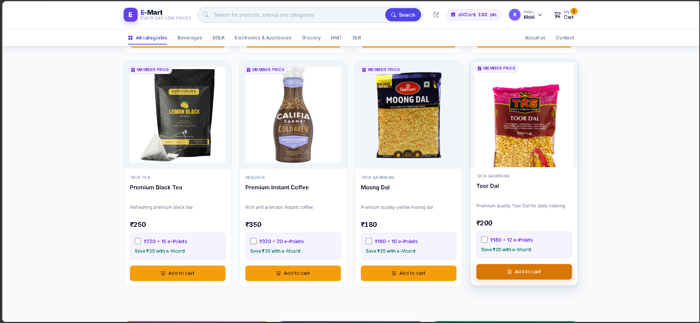
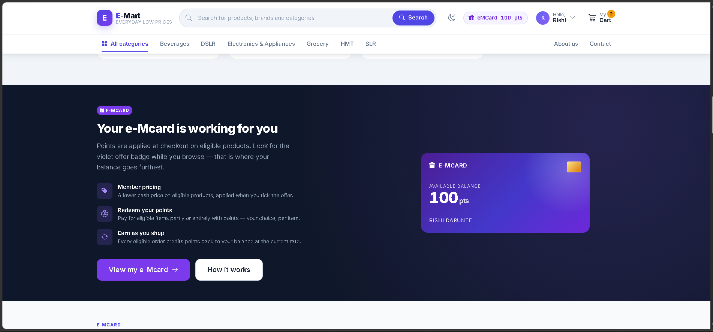
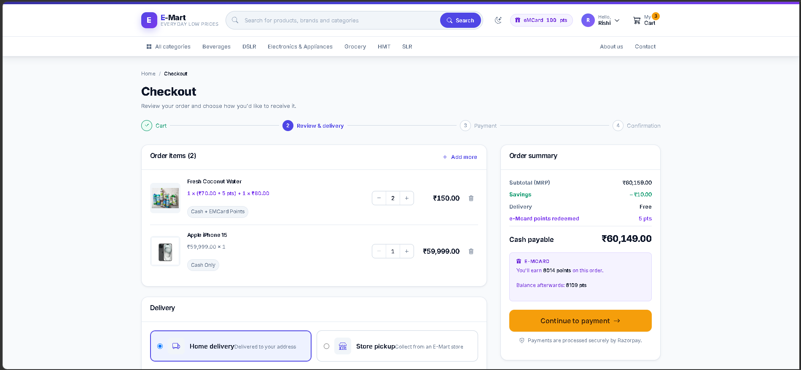
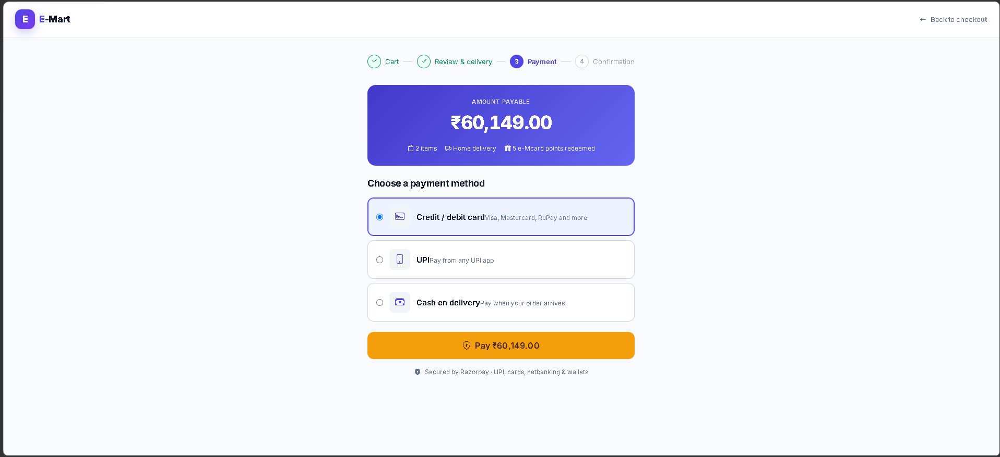
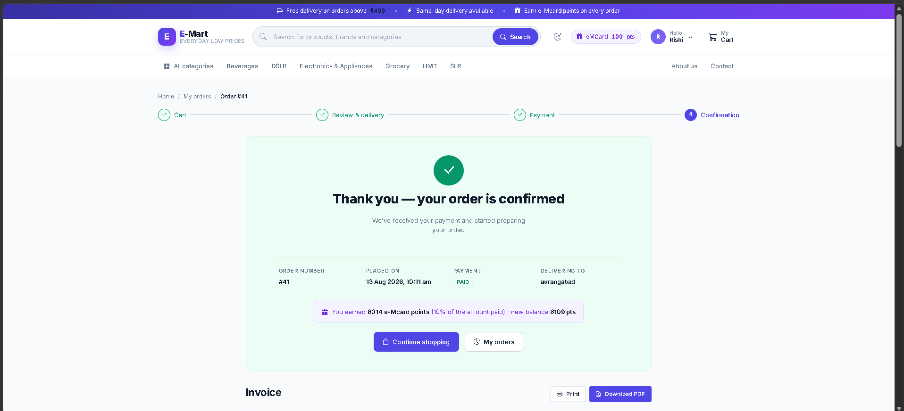
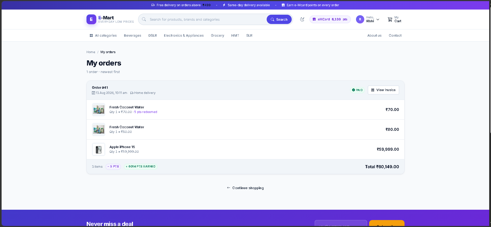
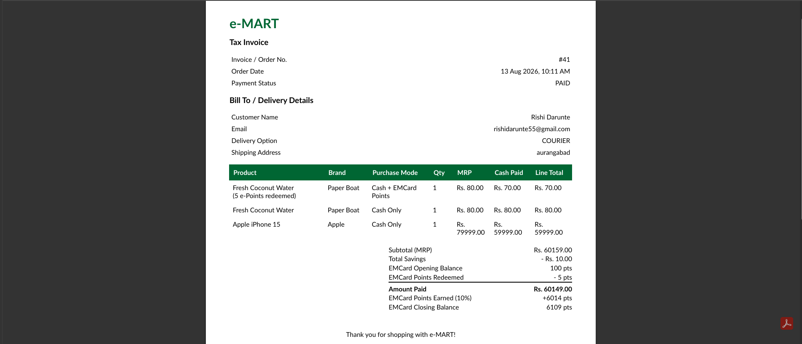

# E-Mart - Full Stack E-Commerce Platform

A comprehensive full-stack e-commerce web application built as a CDAC major project, featuring product browsing, secure checkout, payment integration, and loyalty rewards system.

## 🎯 Features

- **Product Catalog** - Browse across multiple categories (Beverages, Electronics, Grocery, DSLR, HMT, SLR)
- **Shopping Cart** - Add/remove items with real-time price calculation
- **Secure Checkout** - Multi-step checkout with delivery options
- **Payment Gateway** - Razorpay integration for multiple payment methods
- **e-Mart Card** - Loyalty program with reward points and cashback
- **Order Management** - Track orders and download invoices
- **Admin Dashboard** - Manage products, users, and orders

---

## 📸 Screenshots

### 🛒 Promotional Products

*Exclusive deals and promotional items*

### 🏠 Product Catalog

*Browse our collection of products across various categories*

### 💰 e-Mart Card (Loyalty Program)

*Earn reward points on every purchase and redeem for discounts*

### 🛍️ Checkout Process

*Easy multi-step checkout with delivery address selection*

### 💳 Payment Gateway

*Secure payment options including cards, UPI, and wallet*

### ✅ Order Confirmation

*Order successfully placed with confirmation details and e-Points earned*

### 📦 Order Tracking

*View all your orders and track their status*

### 📄 Invoice & Tax Receipt

*Download tax invoices for your purchases*

---

## 🛠️ Tech Stack

| Layer | Technology |
|-------|-----------|
| **Frontend** | React.js, Redux, CSS3 |
| **Backend** | ASP.NET Core (.NET 6+), Spring Boot (Java) |
| **Database** | SQL Server 2019+ |
| **Payment** | Razorpay API |
| **Server** | IIS / Apache Tomcat |

## 📁 Project Structure

```
project-EMart/
├── DotNet Project V2.0/
│   ├── backend-dotnet/       # ASP.NET Core Backend
│   └── frontend-react/       # React.js Frontend
├── Java Project V1.7/
│   ├── backend-spring/       # Spring Boot Backend
│   └── frontend-react/       # React.js Frontend
├── Screenshots/              # Application screenshots
└── README.md
```

## 📋 Prerequisites

- Node.js v14+ & npm
- .NET SDK v6.0+
- Java JDK 11+ (for Java backend)
- SQL Server Express/Developer Edition
- Visual Studio Code / Visual Studio

## 🚀 Quick Start

### Option 1: Using .NET Backend

#### 1. Clone Repository
```bash
git clone https://github.com/lokeshchheda26-cell/E-MART.git
cd E-MART
```

#### 2. Database Setup
```bash
# Create database in SQL Server Management Studio
CREATE DATABASE EMart_DB;

# Navigate to backend and apply migrations
cd "DotNet Project V2.0/backend-dotnet"
dotnet ef database update
```

#### 3. Start Backend
```bash
dotnet restore
dotnet build
dotnet run
# API runs on: http://localhost:5000
```

#### 4. Start Frontend
```bash
cd "../frontend-react"
npm install
npm start
# App opens at: http://localhost:3000
```

### Option 2: Using Java Backend

#### 1. Database Setup (Same as above)
```bash
CREATE DATABASE EMart_DB;
```

#### 2. Start Backend
```bash
cd "Java Project V1.7/backend-spring"
mvn clean install
mvn spring-boot:run
# API runs on: http://localhost:8080
```

#### 3. Start Frontend
```bash
cd "../frontend-react"
npm install
REACT_APP_API_URL=http://localhost:8080 npm start
# App opens at: http://localhost:3000
```

## 📡 API Endpoints

| Endpoint | Method | Purpose |
|----------|--------|---------|
| `/api/products` | GET | Fetch all products |
| `/api/cart` | GET/POST | Manage shopping cart |
| `/api/orders` | GET/POST | Create and view orders |
| `/api/payments/verify` | POST | Verify payment |
| `/api/ecard/balance` | GET | Get loyalty points |

## 🔐 Key Features

- **JWT Authentication** for secure API access
- **Payment Integration** with Razorpay
- **Loyalty Rewards** - Earn 10 points per ₹100 spent
- **Invoice Generation** - Auto-generated PDF receipts
- **Real-time Cart** - Live price updates
- **Dual Backend Support** - .NET or Java implementation

## 👨‍💻 Author

**Lokesh Chedda**
- GitHub: [@lokeshchheda26-cell](https://github.com/lokeshchheda26-cell)

